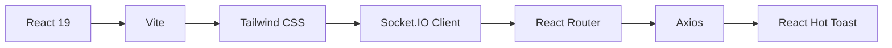
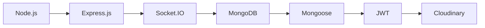
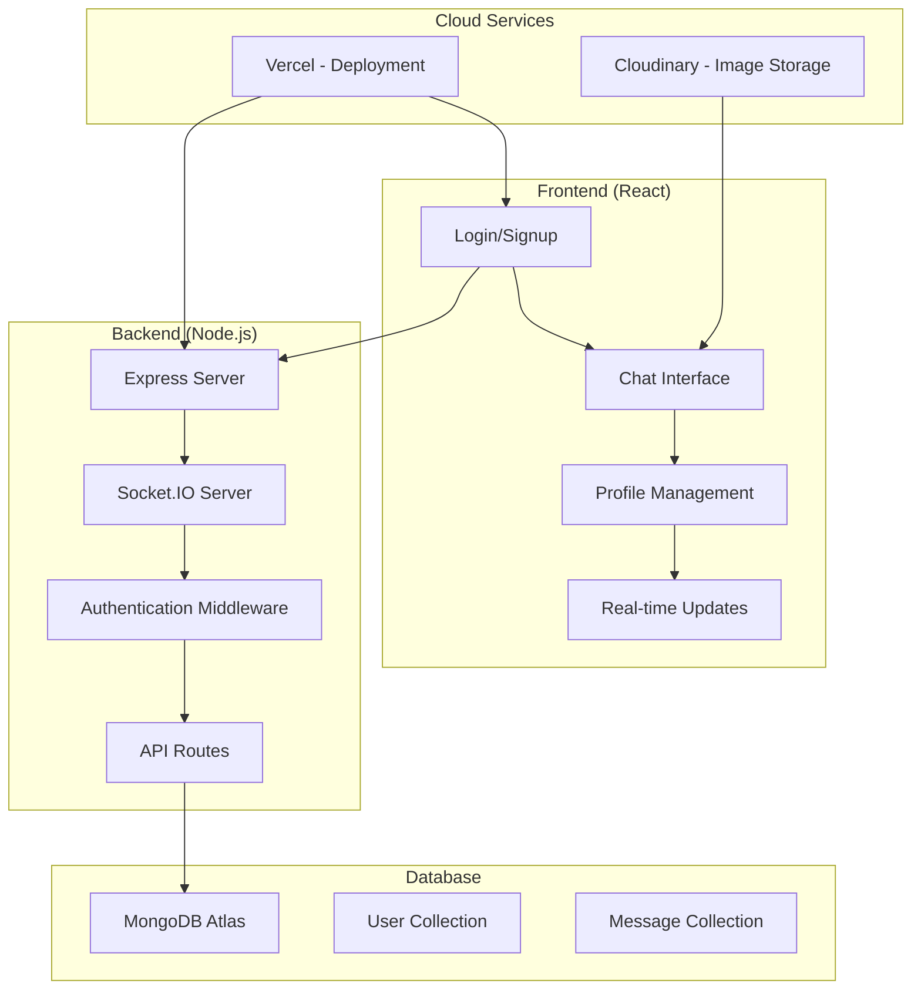
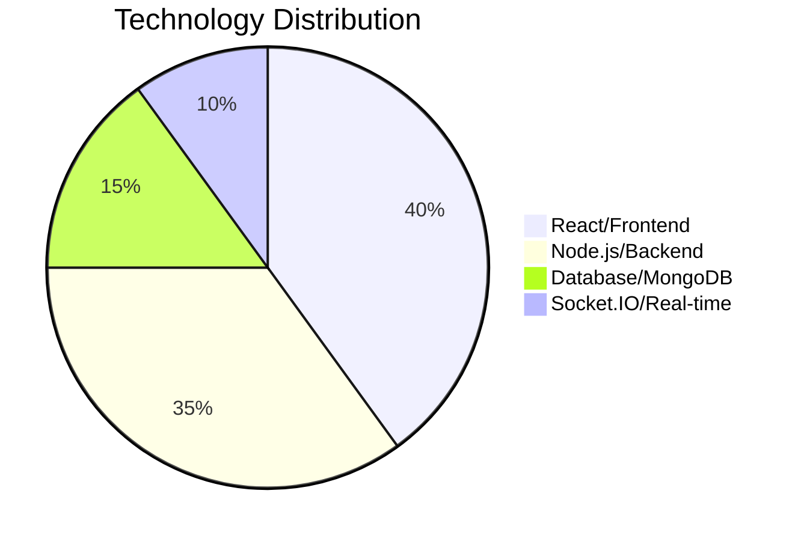

# 💬 Blink Chat Application

<div align="center">


**Don't type. Just Blink.** ✨

[Live Demo 🚀](https://blink-chat-phi.vercel.app/login) 
[](https://github.com/KeshanKaushalya/Blink-Chat_Application)

</div>

---

## 🚀 Overview

Blink is a modern, real-time chat application built with the MERN stack and Socket.IO. Experience seamless communication with instant messaging, online status tracking, and a beautiful, responsive interface.

## ✨ Features

### 🔐 Authentication & Security
- **Secure Registration & Login** - JWT-based authentication
- **Password Encryption** - bcrypt.js for secure password hashing
- **Protected Routes** - Middleware-based route protection

### 💬 Real-Time Messaging
- **Instant Messaging** - Socket.IO powered real-time communication
- **Online Status** - See who's online in real-time
- **Message Status** - Track message delivery and read status
- **Image Sharing** - Send and receive images seamlessly

### 👤 User Management
- **Profile Customization** - Upload profile pictures and bio
- **User Search** - Find and connect with other users
- **Profile Updates** - Edit your information anytime

### 🎨 Modern UI/UX
- **Responsive Design** - Works perfectly on all devices
- **Dark Theme** - Beautiful purple gradient design
- **Smooth Animations** - Enhanced user experience
- **Tailwind CSS** - Modern, utility-first styling

## 🛠️ Tech Stack

### Frontend


### Backend


## 📊 Architecture



## 🗄️ Database Models

### User Model
```javascript
{
  email: String (unique, required),
  fullName: String (required),
  password: String (required, min: 6),
  profilePic: String (default: ""),
  bio: String,
  timestamps: true
}
```

### Message Model
```javascript
{
  senderId: ObjectId (ref: User, required),
  receiverId: ObjectId (ref: User, required),
  text: String,
  image: String,
  seen: Boolean (default: false),
  timestamps: true
}
```

## 🚀 Quick Start

### Prerequisites
- Node.js (v18+)
- MongoDB Atlas account
- Cloudinary account

### Installation

1. **Clone the repository**
```bash
git clone https://github.com/KeshanKaushalya/Blink-Chat_Application.git
cd Blink-Chat_Application
```

2. **Setup Backend**
```bash
cd server
npm install
```

Create `.env` file:
```env
MONGODB_URI=your_mongodb_connection_string
JWT_SECRET=your_jwt_secret
CLOUDINARY_CLOUD_NAME=your_cloudinary_name
CLOUDINARY_API_KEY=your_cloudinary_key
CLOUDINARY_API_SECRET=your_cloudinary_secret
NODE_ENV=development
PORT=5000
```

3. **Setup Frontend**
```bash
cd ../client
npm install
```

Create `.env` file:
```env
VITE_BACKEND_URL=http://localhost:5000
```

4. **Run the Application**

Backend:
```bash
cd server
npm run server
```

Frontend:
```bash
cd client
npm run dev
```

## 📱 Screenshots

<div align="center">

### Login/Signup Interface


### Chat Interface


### Profile Management


</div>

## 🔧 API Endpoints

### Authentication
- `POST /api/auth/signup` - User registration
- `POST /api/auth/login` - User login
- `GET /api/auth/check` - Verify authentication
- `PUT /api/auth/update-profile` - Update user profile

### Messages
- `GET /api/messages/users` - Get all users
- `GET /api/messages/:id` - Get messages with specific user
- `POST /api/messages/send/:id` - Send message to user

## 🌐 Deployment

### Frontend (Vercel)
```bash
npm run build
vercel --prod
```

### Backend (Vercel)
```json
{
  "version": 2,
  "builds": [
    {
      "src": "server.js",
      "use": "@vercel/node"
    }
  ],
  "routes": [
    {
      "src": "/(.*)",
      "dest": "/server.js"
    }
  ]
}
```

## 📈 Performance Metrics



## 🤝 Contributing

1. Fork the repository
2. Create your feature branch (`git checkout -b feature/AmazingFeature`)
3. Commit your changes (`git commit -m 'Add some AmazingFeature'`)
4. Push to the branch (`git push origin feature/AmazingFeature`)
5. Open a Pull Request

## 📄 License

This project is licensed under the MIT License - see the [LICENSE](LICENSE) file for details.

## 👨‍💻 Author

**Keshan Kaushalya**
- GitHub: [@KeshanKaushalya](https://github.com/KeshanKaushalya)
- LinkedIn: [Keshan Kaushalya](https://linkedin.com/in/keshan-kaushalya)

## 🙏 Acknowledgments

- Socket.IO for real-time communication
- Cloudinary for image storage
- Vercel for seamless deployment
- MongoDB Atlas for database hosting

---

<div align="center">

**Made with ❤️ by Keshan Kaushalya**

[](https://github.com/KeshanKaushalya/Blink-Chat_Application/stargazers)
[](https://github.com/KeshanKaushalya/Blink-Chat_Application/network/members)

</div>
